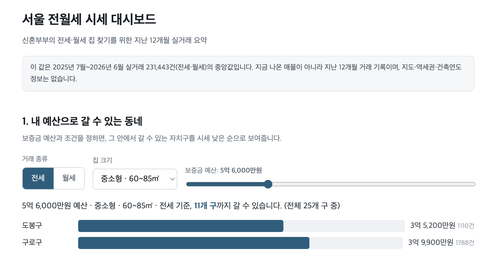

# 7장 — 우리 동네 실거래가 대시보드

서울 아파트 전·월세 실거래 데이터를 **신혼부부 눈높이로** 보여주는 웹 대시보드를,
코드를 한 줄도 직접 쓰지 않고 **클로드와의 대화만으로** 만든 실습입니다.

## 바로 보기

- **온라인 미리보기**: https://ggplab.github.io/apt-dashboard
- 이 폴더의 `index.html`을 **더블클릭**해도 바로 열립니다. (데이터가 파일 안에 들어 있어 인터넷 없이도 동작)

## 실습 자료

| 항목 | 내용 |
|------|------|
| 유즈케이스 | 예산·집 크기·전세/월세 조건으로 살 만한 동네 찾기 |
| 사용 기능 | 프로젝트 규칙 파일(CLAUDE.md)로 작업 방식 고정 · 대화형 화면 제작 · 디자인 시스템 적용 |
| 산출물 | 대시보드(`index.html`) · 소개 발표자료(HTML·PPTX) · 디자인 기준서(`DESIGN.md`) |

## 파일 안내

| 파일 | 설명 |
|------|------|
| `index.html` | 대시보드 본체. 더블클릭하면 브라우저에서 열립니다. |
| `PRD.md` | 무엇을 만들지 먼저 합의한 기획 문서. |
| `CLAUDE.md` | 이 프로젝트에서 클로드가 지킨 작업 규칙. |
| `DESIGN.md` | 색·글꼴·여백을 정한 디자인 기준서 (원티드 디자인시스템 참고). |
| `presentation.html` | 대시보드 소개 발표자료 (6장, 브라우저용. `N` 키로 발표자 노트). |
| `presentation.pptx` | 같은 발표자료의 PowerPoint 버전 (각 장 노트란에 발표자 노트). |

## 데이터

대시보드가 사용하는 원본 데이터는 이 저장소의
[`chap6/seoul-apt-latest.csv`](../chap6/seoul-apt-latest.csv) 입니다. (약 27MB, 서울 실거래 12개월)
`index.html`에는 요약 데이터가 이미 포함되어 있어, CSV 파일 없이도 화면이 그대로 동작합니다.
