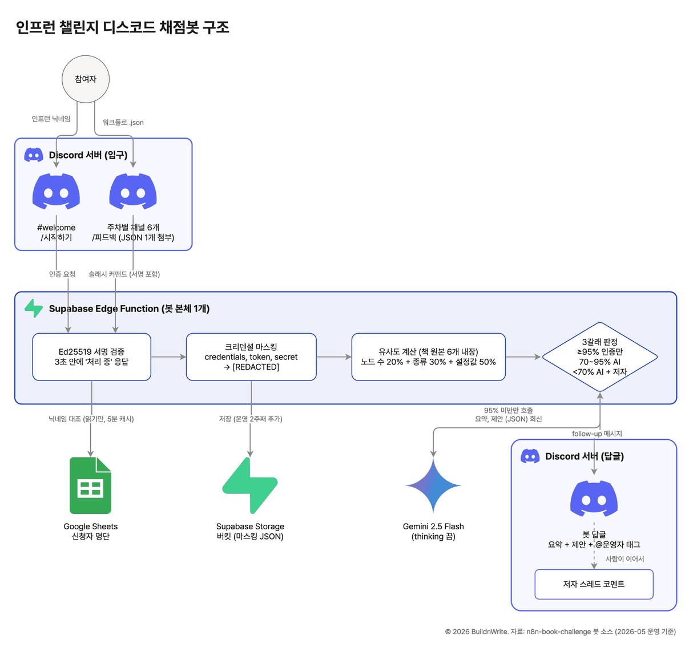

# `architecture-drawio-diagram`: 로고가 큼직한 시스템 구조도를 코드로 그리는 스킬

> 개발 블로그에서 보던 그 그림. 흰 배경, 둥근 상자 안에 처리 단계, 바깥에 큼직한 서비스 로고, 화살표엔 짧은 라벨.
> 이 스킬은 좌표를 파이썬으로 잡아 **draw.io 파일과 PNG를 동시에** 만듭니다. 마음에 안 드는 부분은 draw.io 앱에서 손으로 옮기면 됩니다.

같은 폴더의 [`SKILL.md`](./SKILL.md), [`scripts/drawio_kit.py`](./scripts/drawio_kit.py), [`example/`](./example/)를 그대로 복사해서 씁니다.



---

## 무엇을 해결하나

"우리 서비스가 어떻게 돌아가는지" 그림 한 장이 필요한 순간은 많습니다. 블로그, 발표, 인수인계, 투자 자료.
그런데 그림 도구를 열면 상자 정렬과 로고 찾기에 시간이 다 갑니다. 다음 달 구조가 바뀌면 처음부터 다시 그립니다.

이 스킬은 그림을 **코드로** 둡니다.

| 하는 일 | 방법 |
|---|---|
| 배치 | 파이썬 20~40줄. 상자·로고·화살표 좌표만 적는다 |
| 파일 생성 | `.drawio` (앱에서 열어 손질 가능) + `.png` (폭 1200, 256색, 블로그에 바로) |
| 로고 | `icons/<이름>.png`를 파일 안에 내장. 외부 링크가 깨질 일이 없다 |
| 다시 그리기 | 좌표 몇 줄 고치고 다시 실행 |

## 한 줄 사용 예

```
/architecture-drawio-diagram 참여자가 디스코드로 워크플로 파일을 올리면 Supabase 함수가 검증하고 Gemini가 채점해서 답글 다는 구조를 그려줘
```

클로드가 구조를 행위자 → 입구 → 본체 → 저장소 → 출구로 정리하고, 배치 스크립트를 쓰고, 렌더해서 PNG를 보여줍니다.
겹친 라벨이나 잘린 글자가 있으면 좌표를 고쳐 다시 뽑습니다.

## 설치

| 필요 | 어디서 |
|---|---|
| draw.io 데스크톱 (무료) | https://github.com/jgraph/drawio-desktop/releases (mac·win·linux) |
| python3 + pillow | `pip install pillow` (없어도 PNG는 나오고 크기 축소만 빠진다) |
| 로고 PNG | simpleicons.org (CC0) 또는 각 서비스 공식 브랜드 페이지. 정사각 투명 PNG로 `example/icons/` 처럼 둔다 |

예제 실행:

```bash
python3 example/grading_bot.py
```

`example/out/architecture.drawio`와 `architecture.png`가 생깁니다.

## draw.io가 없다면

| 상황 | 대안 |
|---|---|
| 설치는 못 하지만 브라우저는 된다 | `.drawio`만 만들고 [app.diagrams.net](https://app.diagrams.net)에서 열어 PNG로 내보낸다 |
| 마크다운(GitHub·Notion)에 바로 넣고 싶다 | Mermaid `flowchart` + `subgraph`. 로고는 안 되지만 상자·화살표·라벨은 된다. `SKILL.md`에 뼈대가 있다 |
| 로고 없는 편집용 도식 | 클로드에게 HTML + SVG로 그려 달라고 한다 |

## 스킬 파일 해부

| 파일 | 역할 | 손대나 |
|---|---|---|
| `SKILL.md` | 클로드에게 주는 절차. 구조 확정 → 배치 → 렌더 → 눈으로 확인 | 스타일을 바꿀 때만 |
| `scripts/drawio_kit.py` | 헬퍼 6개(`title` `actor` `container` `step` `logo_node` `edge`)와 렌더 | 안 건드린다 |
| `example/grading_bot.py` | 실제 블로그 글에 쓴 구조도. 복사해서 시작 | 그림마다 새로 |
| `example/icons/` | 로고 PNG | 서비스가 늘면 추가 |

배치 스크립트의 핵심은 이 정도입니다.

```python
d = Diagram(icons_dir="icons")
d.title("서비스 구조", 40, 20)
d.container("API 서버", "supabase", 40, 100, 600, 180)   # 둥근 상자 + 작은 로고 + 제목
a = d.step("요청 검증", 70, 160, 200, 70)                 # 상자 안 단계
b = d.step("DB 저장", 330, 160, 200, 70)
d.edge(a, b, "검증 통과")                                  # 화살표 + 라벨
db = d.logo_node("Google Sheets", "googlesheets", 120, 360)  # 큰 로고
d.edge(a, db, "읽기", exit_=(0.5, 1), entry=(0.5, 0))     # 어느 변에서 나가고 들어올지
d.credit("© 2026 내 이름", 560, 480)
d.render("out/service.drawio", "out/service.png")
```

## 자주 겪는 것

- **화살표가 겹친다**: `exit_`·`entry`로 출발·도착 변을 고정한다. 자동 라우팅에 맡기면 겹친다.
- **로고 색이 이상하다**: SVG를 PNG로 바꿀 때 cairosvg 같은 도구가 그라데이션을 흘린다. 브라우저나 draw.io 앱에서 내보낸다.
- **글자가 잘린다**: `step` 폭을 늘리거나 `<br>`로 줄을 나눈다.
- **그림이 옆으로 퍼진다**: 단계가 5개를 넘으면 컨테이너로 묶고 행을 나눈다.

---

← [스킬 모음](../README.md) · [플레이북 홈](../../README.md)
