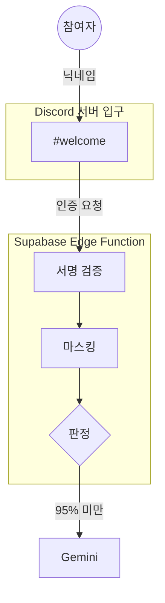

# architecture-drawio-diagram: 로고 큼직한 구조도

티스토리 개발 블로그의 AWS 아키텍처 그림 스타일을 코드로 재현한다. 파이썬이 좌표를 잡아 `.drawio` XML을 쓰고,
draw.io 데스크톱 CLI가 PNG를 뽑는다. `.drawio`는 앱에서 손으로 다듬을 수 있어 "AI가 만들고 사람이 마무리"에 맞는다.

```
배치 스크립트 (그림마다 20~40줄)  ->  scripts/drawio_kit.py  ->  <이름>.drawio  ->  draw.io CLI  ->  <이름>.png (폭 1200, 256색)
        ^ 이것만 쓴다                     손대지 않는다            앱에서 손질 가능
```

## 전제

| 필요 | 확인 | 없으면 |
|---|---|---|
| draw.io 데스크톱 | mac `/Applications/draw.io.app`, win `C:\Program Files\draw.io`, 또는 `DRAWIO_BIN` | §대안 |
| python3 + pillow | `python3 -c "import PIL"` | pillow 없으면 원본 크기 PNG만 나온다 |
| 로고 PNG (정사각, 투명) | `icons/<슬러그>.png` | §로고 |

## 절차

1. **구조를 먼저 확정한다.** 행위자(사람) → 입구(채널·API) → 본체(처리 단계 3~5개) → 저장소·외부 서비스 → 출구. 이 골격이 안 나오면 그림도 안 나온다. 일자 나열 5칸 이상이면 컨테이너로 묶는다.
2. `example/grading_bot.py`를 복사해 배치 스크립트를 만든다. 이름은 `<slug>-architecture.py`. 헬퍼는 `title` `actor` `container` `step` `logo_node` `edge` `credit` 여섯 개면 된다 (`scripts/drawio_kit.py` docstring).
3. 좌표 규칙. 캔버스 폭 1200 기준. 컨테이너는 한 행에 하나, 행 간격 70. 컨테이너 안 step 은 폭 200~260, 높이 80, 간격 60. 외부 서비스 logo_node 는 96px, 라벨 두 줄까지.
4. 화살표는 `exit_`/`entry` 로 출발·도착 변을 고정한다 (자동이면 겹친다). 라벨은 짧게, 되돌아오는 흐름은 `both=True`, 사람이 잇는 구간은 `dashed=True`.
5. **제목과 크레딧을 그림 안에 넣는다.** 블로그 이미지는 단독으로 돌아다닌다. 크레딧에 자료 출처와 기준 시점을 적는다.
6. 렌더 후 PNG를 **눈으로 본다.** 라벨 겹침·화살표 교차·잘린 글자를 보고 좌표를 고친다. 손질이 많으면 `.drawio`를 앱에서 열어 옮긴 뒤 좌표를 스크립트에 되먹인다 (스크립트가 SSOT).
7. 결과 PNG 폭 1200·256색이 기본. 블로그는 그대로 쓰고, 슬라이드용은 `render(..., width=2400)`.

## 로고

- CC0 또는 브랜드 가이드가 허용하는 마크만. 출처 우선순위: 각 서비스 공식 브랜드 페이지 → simpleicons.org (CC0 SVG).
- 정사각 240px 투명 PNG로 굽고 `icons/<슬러그>.png`. SVG를 PNG로 바꿀 때 cairosvg는 그라데이션을 흘린다 (Gemini 로고가 보라 단색으로 굳었던 실사고). 브라우저 렌더(playwright)나 draw.io 앱에서 직접 내보낸다.
- base64 내장이 기본이다. draw.io CLI가 외부 파일 경로를 못 읽는다.

## 대안: draw.io 데스크톱이 없을 때

| 상황 | 방법 | 잃는 것 |
|---|---|---|
| CLI만 없고 브라우저는 있다 | `d.render("x.drawio")`(PNG 인자 생략)로 `.drawio`만 만들고 app.diagrams.net 에서 열어 File → Export as → PNG | 자동화. 손으로 한 번 내보낸다 |
| 설치 자체가 안 된다, 마크다운에 바로 넣고 싶다 | Mermaid `flowchart` + `subgraph`. 컨테이너는 subgraph, 단계는 노드, 라벨은 `-->|라벨|`. GitHub·Notion·대부분 블로그가 그대로 렌더 | 로고. 노드는 텍스트 상자다. `architecture-beta` 문법은 아이콘은 되지만 화살표 라벨이 안 된다 |
| 로고 없이 편집 도식이 필요하다 | 클로드에게 HTML + inline SVG로 그려 달라고 한다 (`diagram-design` 류 스킬이 있으면 그것) | 로고, 앱에서 손질 |

Mermaid 뼈대:



## 기각한 대안 (같은 그림으로 실측, 2026-09-05)

- Diagrams(mingrammer): 자동 배치라 빠르지만 행 제어만 된다. 로고 팩이 AWS·GCP 위주.
- Mermaid architecture-beta: 화살표 라벨 미지원.
- D2: 행 고정이 안 되어 가로 7:1로 퍼진다.

## 완료 판정

- `python3 <slug>-architecture.py` 가 `.drawio`와 `.png` 둘 다 쓴다.
- PNG를 열어 라벨 겹침 0, 잘린 글자 0.
- 그림 안에 제목·크레딧이 있다.
