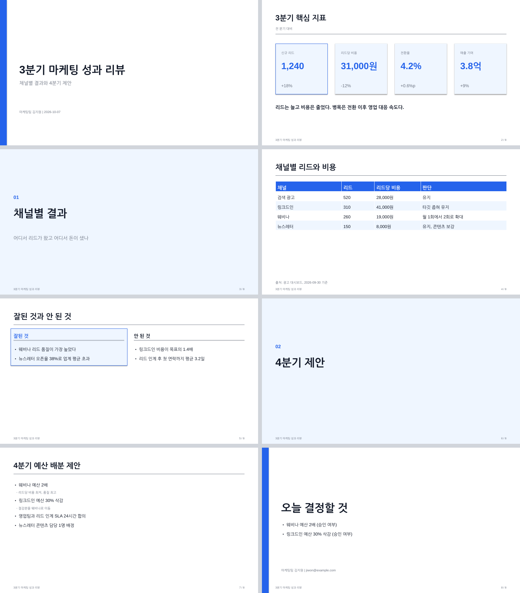

# `json-to-pptx`: 문안 JSON 한 장으로 보고용 덱을 뽑는 스킬

> 클로드에게 "PPT 만들어줘"라고 하면 매번 다른 모양이 나옵니다. 이 스킬은 **모양을 코드로 고정**하고
> 클로드는 문안만 채우게 해서, 매주 같은 형식의 보고 덱이 같은 모양으로 나오게 합니다.

같은 폴더의 [`SKILL.md`](./SKILL.md), [`scripts/build_pptx.py`](./scripts/build_pptx.py),
[`examples/quarterly-review.json`](./examples/quarterly-review.json)을 복사해서 씁니다.

---

## 무엇을 해결하나

클로드 앱의 기본 PowerPoint 기능은 편리하지만 두 가지가 아쉽습니다.

- 만들 때마다 레이아웃이 달라 **팀 보고 형식이 유지되지 않는다**
- 문안을 고치려면 다시 처음부터 시켜야 해서 **작은 수정이 비싸다**

이 스킬은 역할을 나눕니다.

| 역할 | 담당 | 파일 |
|---|---|---|
| 무엇을 말할지 (문안, 순서, 발표자 노트) | 클로드와 사용자 | `content.json` |
| 어떻게 보일지 (여백, 글자 크기, 색) | 스크립트 | `build_pptx.py` |

문안이 바뀌면 JSON만 고치고 다시 돌립니다. 모양이 바뀌면 스크립트만 고치고 모든 덱에 적용됩니다.

### 한 줄 사용 예

```
/json-to-pptx 아래 내용으로 주간 보고 덱 만들어줘. 8장 이내, 마지막은 결정 요청.
(내용 붙여넣기)
```

클로드가 JSON을 쓰고 스크립트를 돌린 뒤 이렇게 보고합니다.

```
[완료] weekly-report.pptx  (8장)
```

예제 JSON으로 만든 덱은 이런 모양입니다. 표지, KPI 카드, 간지, 표, 2열 비교, 불릿, 마무리 순입니다.



---

## 스킬 파일 해부

```yaml
---
name: json-to-pptx
description: 업무용 발표 덱(.pptx)을 콘텐츠 JSON 한 파일에서 만든다. ... 문안 확정이 먼저이고 이 스킬은 문안을 pptx로 옮기는 단계만 담당한다.
argument-hint: "<content.json> [out.pptx]"
---
```

`SKILL.md` 본문은 네 단계입니다.

| 단계 | 하는 일 |
|---|---|
| 1. 문안 확정 | 청중, 결론 한 문장, 장 수를 먼저 묻는다. 만들고 나서 구조를 바꾸면 전부 다시 만들기 때문 |
| 2. JSON 작성 | 예제를 복사해 채운다. 슬라이드 유형 7종 |
| 3. 생성 | 스크립트 실행. 불릿 6개, 표 8행을 넘으면 경고 |
| 4. 확인 | 장 수 대조, PDF로 넘겨 보기, 배포본은 `pptx-finalize`로 |

`build_pptx.py`의 설계 세 가지가 이 스킬의 핵심입니다.

- **글자 크기 사다리** `TYPE`: display 40, title 28, heading 18, body 16, caption 12. 함수는 이름으로만 크기를 고르므로 덱 전체의 위계가 흔들리지 않습니다.
- **색은 JSON이 갖는다**: `theme.accent` 하나만 바꾸면 회사 색으로 바뀝니다. 코드에 색을 새로 넣지 않습니다.
- **과밀 경고**: 불릿 7개, 표 9행, KPI 5개부터 경고합니다. 글자를 줄여 욱여넣는 대신 장을 나누게 유도합니다.

---

## 따라 만들기 (5분)

### 1. python-pptx 설치

```bash
pip install python-pptx
```

### 2. 스킬 복사

```bash
mkdir -p ~/.claude/skills/json-to-pptx/scripts ~/.claude/skills/json-to-pptx/examples
cp 02-skills/json-to-pptx/SKILL.md ~/.claude/skills/json-to-pptx/
cp 02-skills/json-to-pptx/scripts/build_pptx.py ~/.claude/skills/json-to-pptx/scripts/
cp 02-skills/json-to-pptx/examples/quarterly-review.json ~/.claude/skills/json-to-pptx/examples/
```

### 3. 예제로 확인

```bash
python3 ~/.claude/skills/json-to-pptx/scripts/build_pptx.py ~/.claude/skills/json-to-pptx/examples/quarterly-review.json
```

같은 폴더에 `quarterly-review.pptx`가 생기고 PowerPoint로 열립니다. 8장이면 성공입니다.

### 4. 우리 팀 형식으로

- `theme.accent`를 회사 색으로, `theme.font`를 팀 기본 폰트로 바꿉니다.
- 매주 쓰는 형식이 있으면 그 JSON을 `examples/weekly.json`으로 저장해 두고 "이 형식으로"라고 시킵니다.

---

## 왜 이렇게 만드나 (설계 포인트)

- **pptx로 만든다.** PDF나 HTML은 받는 사람이 고칠 수 없습니다. 보고 자료는 결국 누군가 손봅니다.
- **문안이 먼저다.** 슬라이드를 만든 뒤 구조를 바꾸면 비용이 큽니다. 스킬이 먼저 세 가지를 묻게 했습니다.
- **말할 것은 노트에.** 화면에 문장을 다 쓰면 청중이 먼저 읽어 버립니다. `notes`가 발표자 노트로 들어갑니다.

---

## 더 확장하기

- 차트 슬라이드: python-pptx의 `add_chart`로 막대와 선 차트 유형을 추가합니다.
- 회사 템플릿 위에 그리기: `Presentation("회사템플릿.pptx")`로 시작하면 마스터의 로고와 푸터를 상속합니다.
- 마크다운에서 JSON 만들기: 회의록 마크다운을 JSON으로 바꾸는 단계를 `SKILL.md` 1단계에 붙이면 "회의록에서 덱까지"가 한 명령이 됩니다.
- 배포: `pptx-finalize` 스킬을 이어 붙이면 폰트 임베드와 PDF까지 한 번에 끝납니다.

---

← [스킬 모음으로 돌아가기](../README.md)
