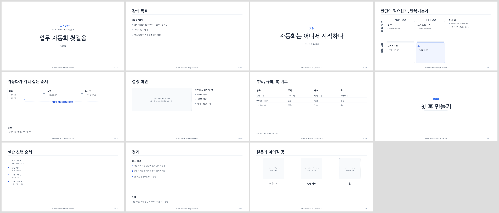
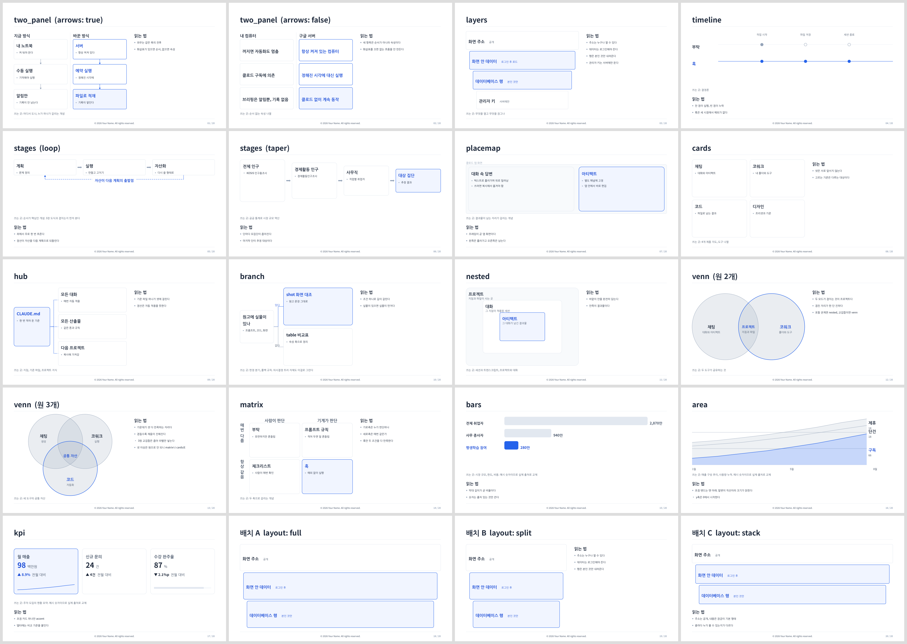

# `lecture-slide-make`: 강의 슬라이드를 JSON 한 장에서 뽑고, 도식은 결정 트리로 고르는 스킬

> 클로드에게 "강의 슬라이드 만들어줘"라고 하면 매번 다른 모양이 나오고, 도식은 대부분 불릿으로 도망갑니다.
> 이 스킬은 **모양을 코드로 고정**하고, **어떤 도식을 그릴지 세 가지 질문으로 판정**하게 해서
> 같은 강의안이 같은 모양의 편집 가능한 pptx로 나오게 합니다.

같은 폴더의 [`SKILL.md`](./SKILL.md), [`scripts/`](./scripts/), [`themes/`](./themes/), [`references/`](./references/), [`examples/`](./examples/)를 통째로 복사해서 씁니다.

---

## 무엇을 해결하나

클로드 앱의 기본 PowerPoint 기능은 편리하지만 강의 자료에는 세 가지가 아쉽습니다.

- 만들 때마다 레이아웃이 달라 **회차 사이에 모양이 유지되지 않는다**
- 개념 설명이 전부 불릿이라 **도식이 있어야 할 자리에 글이 온다**
- 문안을 고치려면 처음부터 다시 시켜야 해서 **작은 수정이 비싸다**

이 스킬은 역할을 셋으로 나눕니다.

| 역할 | 담당 | 파일 |
|---|---|---|
| 무엇을 말할지 (문안, 순서, 발표자 노트) | 클로드와 사용자 | `content.json` |
| 어떤 도식으로 보일지 | 결정 트리 | `references/decision-tree.md` |
| 어떻게 보일지 (여백, 글자 크기, 색) | 스크립트 | `scripts/build_deck.py` + `themes/` |

문안이 바뀌면 JSON만 고치고 다시 돌립니다. 모양이 바뀌면 스크립트만 고치고 모든 덱에 적용됩니다.

### 한 줄 사용 예

```
/lecture-slide-make 아래 강의안으로 세미나룸용 덱 만들어줘. 12장 이내, 개념마다 도식 하나.
(강의안 붙여넣기)
```

클로드가 구조를 묻고, JSON을 쓰고, 장마다 결정 트리로 도식을 고른 뒤 스크립트를 돌려 이렇게 보고합니다.

```
   테마 blue-slate 1.0.0
→ lecture.pptx  (11장)
```

예제 JSON으로 만든 덱은 이런 모양입니다. 표지, 강의 목표, 간지, 매트릭스 도식, 단계 도식, 스크린샷, 비교표, 실습 절차, 정리, 연락처 순입니다.



---

## 시각 요소 결정 트리

슬라이드 한 장의 몸통을 무엇으로 채울지 고르는 흐름입니다. 위에서 아래로 내려가며 처음 "예"가 나오는 곳에서 멈춥니다. 어디에도 안 걸리면 그때 불릿입니다. 불릿은 폴백이지 기본값이 아닙니다.


| 질문 | 무엇을 가르나 |
|---|---|
| **Q1. 실물을 봐야 아는가** | 화면이나 텍스트 실물이 있어야 이해되는 개념이면 도식을 그리지 않고 스크린샷(`shot`)이나 표(`table`)를 씁니다 |
| **Q2. 뼈대 관계는 무엇인가** | 개념을 이루는 요소들 사이의 관계가 순서, 포함, 분배, 분기, 병렬, 위치, 양 중 어느 것인지. 여덟 갈래는 서로 배타적입니다 |
| **Q3. 대비의 형태는 무엇인가** | Q2에서 "대비"로 온 경우에만. 판단 축이 둘이면 매트릭스, 시점별이면 타임라인, 좌우 구조가 다르면 두 패널, 속성이 많으면 표 |

트리의 잎은 전부 생성기 프리셋 14종 중 하나입니다. 아래는 그 실물이며, 전부 스크립트가 뽑은 슬라이드라 pptx 안에서 도형 그대로 편집됩니다.

| | | |
|---|---|---|
|  `two_panel` 좌우가 서로 다른 흐름으로 돈다 |  `two_panel` 순서 없는 항목 나열 |  `layers` 층마다 성질이 다르다 |
|  `timeline` 시점별 실행 여부 |  `stages` 좌우 흐름 + 회귀 루프 |  `stages` 단마다 좁아지는 깔때기 |
|  `placemap` 한 화면 안의 자리 |  `cards` 동등한 항목 N개 |  `hub` 중심 하나가 여러 곳에 |
|  `branch` 조건 하나로 갈린다 |  `nested` 포함 관계 |  `matrix` 2×2 사분면 |
|  `bars` 수치 비교 |  `area` 누적 추세 |  `kpi` 핵심 지표 카드 |
|  `venn` 일부만 겹치는 집합 | | |

도식이 슬라이드 안에서 차지하는 자리는 세 가지입니다.

| | | |
|---|---|---|
|  `layout: full` 도식이 전폭 |  `layout: split` 좌 도식 + 우 설명 |  `layout: stack` 상 도식 + 하 설명 |

프리셋별 규칙과 한도, JSON 키는 [`references/decision-tree.md`](./references/decision-tree.md)에 있습니다.

---

## 슬라이드 해부도

생성기와 검수가 같은 이름을 쓰기 위한 용어집입니다. "제목 위에 있는 작은 글자"라고 하면 못 고칩니다. 이름이 있어야 규칙을 세울 수 있습니다.


| 번호 | 이름 | 한 줄 | 판정 |
|---|---|---|---|
| ① | 키커 / 러닝헤드 | 제목 위에 얹는 작은 라벨. 덱 전체에 반복되면 러닝헤드 | **폐기**. 장 타이틀이 그 일을 한다 |
| ② | 헤드라인 (장 타이틀) | 그 장에서 가장 큰 글자. 짧은 명사 한 단 | 채택 |
| ③ | 서브헤드 | 제목을 보충하는 짧은 명사구 | 기본 끔 |
| ④ | 리드인, 본문 불릿, 소제목 | 실제 내용. 소제목은 자기가 거느린 본문보다 반드시 크다 | 채택 |
| ⑤ | 섹션 라벨, 콜아웃 | 구역 머리 라벨과 강조 박스. 콜아웃은 한 장에 하나 | 채택 |
| ⑥ | 캡션, 데이터 라벨 | 이미지 아래 설명, 차트 위 수치 | 채택 |
| ⑦ | 소스라인 | 출처와 단서. 최하단 한 줄 | 채택 |
| ⑧ | 푸터 (카피라이트) | 매 장 반복되는 띠. 내용이 아니라 액자라서 "크롬"이라 부른다 | 채택 |
| ⑨ | 폴리오 (페이지 번호) | `07 / 24`. 남은 분량이 보여야 한다 | 채택 |

글자 크기는 일곱 계층 이름으로만 고릅니다. 스크립트 상단 `TYPE` 표가 이 값을 갖고, 함수는 이름으로만 크기를 받으므로 덱 전체의 위계가 흔들리지 않습니다.


덱 골격, 문체 시그니처 6종, 강의와 강연의 장르 차이, 표기 치트시트, 마감 게이트 4단은 [`references/slide-anatomy.md`](./references/slide-anatomy.md)에 있습니다.

---

## 스킬 파일 해부

```yaml
---
name: lecture-slide-make
description: 강의, 세미나, 사내 교육 슬라이드 덱(.pptx)을 콘텐츠 JSON 한 파일에서 만든다. ... 문안 확정이 먼저이고 도식은 결정 트리로 고른다.
argument-hint: "<content.json> [out.pptx] [--strict-assets]"
---
```

`SKILL.md` 본문은 다섯 단계입니다.

| 단계 | 하는 일 |
|---|---|
| 1. 구조 확정 | 청중, 장르, 장 수를 먼저 묻는다. 완성 덱 대신 3안 × 3장을 먼저 내서 고르게 한다 |
| 2. JSON 작성 | 예제를 복사해 채운다. 슬라이드 유형 11종 |
| 3. 시각 요소 판정 | 장마다 결정 트리 세 질문. 불릿은 폴백 |
| 4. 생성 | 스크립트 실행. 어절 초과와 미수집 스크린샷을 경고 |
| 5. 마감 게이트 | 렌더 → 금지 문자 grep → 새 대화에서 검수 → 사람 최종 |

폴더 구성은 이렇습니다.

```
lecture-slide-make/
├── SKILL.md                    절차
├── scripts/
│   ├── build_deck.py           JSON → pptx 생성기. 슬라이드 11유형 + 도식 14종
│   └── compare_deck.py         생성본과 손질본 대조. 손질이 곧 생성기 개선 데이터
├── themes/
│   ├── blue-slate.json         파랑 + 슬레이트 회색 (기본)
│   └── ink-neutral.json        검정 + 회색
├── references/
│   ├── decision-tree.md        시각 요소 결정 트리
│   ├── slide-anatomy.md        슬라이드 해부도
│   └── pipeline.md             정본이 넘어가는 순서, 재생성 금지, 검수 루프
└── examples/
    ├── lecture-sample.json     강의 예제 11장
    └── preset-catalog.json     도식 프리셋 14종 실물
```

`build_deck.py`의 설계 세 가지가 이 스킬의 핵심입니다.

- **글자 크기 사다리** `TYPE`: display 56, title 36, heading 20, label 18, body 16, caption 14, chrome 12. 함수는 이름으로만 크기를 고릅니다.
- **색은 테마 파일이 갖는다**: `themes/<이름>.json` 하나를 바꾸면 덱 전체가 회사 색으로 바뀝니다. 코드에 색을 넣지 않습니다.
- **도식은 네이티브 도형**: 이미지가 아니라 python-pptx 도형이라 PowerPoint에서 글자와 상자를 그대로 고칩니다.

---

## 따라 만들기 (5분)

### 1. 의존성 설치

```bash
pip install python-pptx pillow
```

PDF 변환까지 하려면 LibreOffice가 필요합니다. Pillow는 없어도 돌아갑니다.

### 2. 스킬 복사

```bash
mkdir -p ~/.claude/skills/lecture-slide-make
cp -R 02-skills/lecture-slide-make/. ~/.claude/skills/lecture-slide-make/
```

### 3. 예제로 확인

```bash
python3 ~/.claude/skills/lecture-slide-make/scripts/build_deck.py \
  ~/.claude/skills/lecture-slide-make/examples/lecture-sample.json /tmp/lecture.pptx
```

`/tmp/lecture.pptx`가 생기고 PowerPoint로 열립니다. 11장이면 성공입니다. 스크린샷 자리는 점선 빈 슬롯으로 나오는데, 예제에 이미지가 없어서 그런 것이라 정상입니다.

프리셋 14종을 한 번에 보려면 카탈로그를 뽑습니다.

```bash
python3 ~/.claude/skills/lecture-slide-make/scripts/build_deck.py \
  ~/.claude/skills/lecture-slide-make/examples/preset-catalog.json /tmp/catalog.pptx
```



### 4. 우리 강의 형식으로

- `themes/blue-slate.json`을 복사해 회사 색으로 바꾸고 JSON의 `theme`에 그 이름을 적습니다.
- Windows에서 열 파일이면 JSON의 `font`를 `"Malgun Gothic"`으로 둡니다.
- 매번 쓰는 골격이 있으면 그 JSON을 `examples/`에 저장해 두고 "이 형식으로"라고 시킵니다.

---

## 왜 이렇게 만드나 (설계 포인트)

- **pptx로 만든다.** PDF나 HTML은 받는 사람이 고칠 수 없습니다. 강의 자료는 결국 강사가 손봅니다.
- **불릿은 폴백이다.** 개념 설명이 전부 불릿이면 청중은 읽느라 안 듣습니다. 결정 트리가 도식으로 먼저 가게 강제합니다.
- **손질본이 생기면 다시 뽑지 않는다.** 강사가 pptx에 손을 댄 순간 그 파일이 정본입니다. 재생성하면 손으로 붙인 스크린샷이 전부 사라집니다. 대신 `compare_deck.py`로 손질을 재서 다음 덱의 생성기에 반영합니다.
- **말할 것은 노트에.** 화면에 문장을 다 쓰면 청중이 먼저 읽어 버립니다. `notes`가 발표자 노트로 들어갑니다.

---

## 더 확장하기

- 새 슬라이드 유형: `talk_<이름>` 함수를 추가하고 `TALK_SLIDES`에 등록합니다.
- 새 도식 프리셋: `_fig_<이름>` 함수를 추가하고 `FIGURES`에 등록합니다. 결정 트리의 어느 가지에 다는지 함께 적습니다.
- 회사 템플릿 위에 그리기: `Presentation("회사템플릿.pptx")`로 시작하면 마스터의 로고와 푸터를 상속합니다.
- 강의안에서 JSON 만들기: 강의안 마크다운을 JSON으로 바꾸는 단계를 `SKILL.md` 2단계에 붙이면 "강의안에서 덱까지"가 한 명령이 됩니다.

---

← [스킬 모음으로 돌아가기](../README.md)
