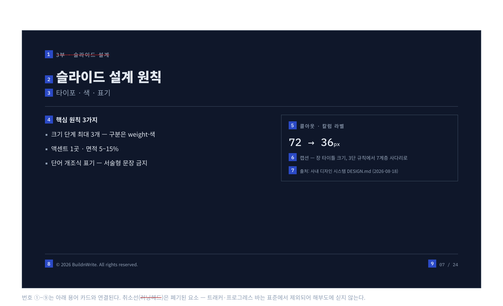
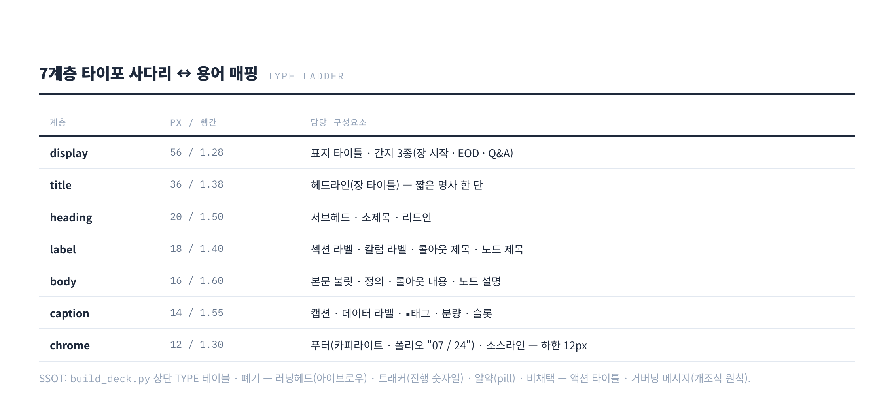

# 슬라이드 해부도

슬라이드 한 장을 이루는 요소의 이름과 크기, 덱 전체의 골격, 문안 표기 규칙을 한 장에 모았다. 생성기와 검수가 같은 이름을 쓰기 위한 용어집이다.

번호 ①~⑨는 아래 용어와 연결된다. 취소선은 폐기된 요소다.

## 구성요소, 존별

### 헤더 존

| 번호 | 이름 | 무엇인가 | 타이포 계층 | 판정 |
|---|---|---|---|---|
| ① | 키커 / 아이브로우 (Kicker, Eyebrow) | 제목 위에 얹는 작은 라벨. 섹션명, 챕터 번호 | | **폐기**. 장 타이틀이 그 일을 한다 |
| ① | 러닝헤드 (Running Head) | 키커가 덱 전체에 반복되는 것. 책의 면주 | | **폐기** |
| ② | 헤드라인 / 장 타이틀 (Slide Title) | 그 장에서 가장 큰 글자. 짧은 명사 한 단 ("강의 목표") | title 36 | 채택 |
| ② | 액션 타이틀 / 거버닝 메시지 | 제목을 결론 문장으로 쓰는 컨설팅 덱 관행 | | **비채택**. 개조식 원칙과 충돌 |
| ③ | 서브헤드 / 부제 | 제목을 보충하는 짧은 명사구 | heading 20 | 기본 끔. 필요한 장에만 |

### 본문 존

| 번호 | 이름 | 무엇인가 | 타이포 계층 |
|---|---|---|---|
| ④ | 리드인 (Lead-in) | 제목과 불릿 사이를 잇는 요약 명사구 ("핵심 원칙 3가지") | heading 20 |
| ④ | 본문 / 불릿 | 실제 내용. ▪ 사각 불릿, 단어 개조식 | body 16 |
| ④ | 소제목 (Heading) | 본문 안에서 덩어리를 나누는 제목. 자기가 거느린 본문보다 반드시 크다 | heading 20 |
| ⑤ | 섹션 / 칼럼 라벨 | 표, 칼럼, 구역의 머리 ("Before / After") | label 18 |
| ⑤ | 콜아웃 (Callout) | 본문에서 꺼내 강조하는 박스. 한 장에 하나 | 제목 label 18, 내용 body 16 |
| ⑥ | 캡션 (Caption) | 이미지와 차트 아래 설명. 태그, 슬롯명도 이 계층 | caption 14 |
| ⑥ | 데이터 라벨 | 차트 막대 위에 직접 얹는 수치. 범례보다 우선 | caption 14 |
| ⑦ | 소스라인 / 각주 | 출처와 단서. 최하단 한 줄 | chrome 12 |

### 푸터 존 (크롬)

내용이 아니라 액자라서 크롬(chrome)이라 묶어 부른다.

| 번호 | 이름 | 무엇인가 | 타이포 계층 |
|---|---|---|---|
| ⑧ | 푸터 | 매 장 하단에 반복되는 띠. 카피라이트가 들어간다 | chrome 12 |
| ⑨ | 폴리오 / 페이지 번호 | `현재 / 전체` 형식 ("07 / 24"). 남은 분량이 보여야 한다. 하한 12px | chrome 12 |
| | 로고 / 워드마크 | 표지에 크게 한 번, 본문 장에서는 푸터에 작게 반복하거나 뺀다 | |

## 타이포 사다리 7계층

크기는 이름으로만 고른다. 새 크기를 만들지 않고, 같은 계층 안의 구분은 굵기(400/700)와 색으로 낸다. 캔버스 1280×720 기준이며 pt는 px×0.75다.

| 계층 | px / 행간 | 담당 구성요소 |
|---|---|---|
| display | 56 / 1.28 | 표지 타이틀, 간지 3종 |
| title | 36 / 1.38 | 헤드라인(장 타이틀) |
| heading | 20 / 1.50 | 서브헤드, 소제목, 리드인 |
| label | 18 / 1.40 | 섹션 라벨, 칼럼 라벨, 콜아웃 제목, 도식 노드 제목 |
| body | 16 / 1.60 | 본문 불릿, 정의, 콜아웃 내용, 노드 설명 |
| caption | 14 / 1.55 | 캡션, 데이터 라벨, 태그, 슬롯 |
| chrome | 12 / 1.30 | 푸터, 페이지 번호, 소스라인. **하한 12, 더 내리지 않는다** |

세미나룸처럼 뒷자리가 먼 자리는 본문 단만 20pt로 올린다(`_meta.venue: "room"`).

## 덱 구조, 코어와 옵션

기본 골격은 **표지 → [장 시작 간지 → 본문 장들] × N → 정리 간지**다. 트래커와 프로그레스 바는 표준에서 뺐다.

| 장 | 코어/옵션 | 무엇인가 |
|---|---|---|
| 표지 (`cover`) | 코어 | 강의명, 회차. 덱에서 가장 큰 타이포 |
| 간지 (`divider`) | 코어 | 흐름을 끊고 전환을 알린다. 텍스트 최소. 장 시작 간지, 정리 간지, Q&A 간지(라이브만) 3종 |
| 레이아웃 그리드 / 마진 | 코어 | 장마다 마진이 흔들리면 덱이 헐거워 보인다 |
| 정리 (`recap`) | 코어 | 핵심 문장 번호 리스트 + (선택) 인계 |
| 이어질 곳 (`contacts`) | 코어 | QR 3장. 발표가 끝난 뒤 이어질 경로 |
| 아젠다 / 목차 | 옵션 | 부가 3개 이상이거나 긴 라이브 세션 |
| 백커버 | 옵션 | 정리 간지로 충분하면 생략 |

## 문체 시그니처 6종

| 시그니처 | 예 |
|---|---|
| 화살표 압축 | "근거 → 결론". 유니코드 → 만 쓰고 `->`는 금지 |
| 대괄호 라벨 | `[실습 1]`, `[Tip]`. UI 표기도 대괄호: "[+] 버튼" |
| 개조식 명사형 | 불릿은 ~함 / ~음 / ~됨 / 명사로 종결. 예외는 정리 장의 정의문 하나뿐 |
| 대구 구조 | 장점/단점, AS-IS/TO-BE, 문제/해결. 트레이드오프는 항상 쌍으로 |
| 볼드+콜론 정의 | "**디자인 패턴**: 공통 문제에 대한 해결책을 정형화한 것" |
| 비교표 우선 | 개념 대비는 산문 대신 2~4열 표 |

## 장르 이원화

같은 사람이 장르에 따라 제목과 톤을 갈라 쓴다. `_meta.genre`로 선언한다.

| | 강의와 컨설팅 (`lecture`) | 강연과 스토리텔링 (`talk`) |
|---|---|---|
| 제목 | 명사형 한 단 ("자동화 설계의 계층 구조") | 반말 완결문 훅 ("나는 올해 채용 계획을 취소했다") + 라벨+콜론 |
| 톤 | 건조한 개조식, 기술 문서 | 반말 독백, 자조 유머, 밈 허용 |
| 불릿 | ▪ 3단 위계 | 장당 2~4개, 마커 없음 |
| 재료 | 강의안, 이론 자료, 리서치 | 본인 회고. 음성 전사, 메모, 실측 산출물 |

## 표기 치트시트

| 항목 | 규칙 |
|---|---|
| 번호 3종 | `1.` 순차 절차 / `①②③` 화면 구성 지시 / `Step N` 실습 단계. 용도별 고정, 혼용 금지 |
| 용어 병기 | 국문(English). "디자인 패턴(Design Pattern)" |
| 화살표 | `→`. `->` 금지 |
| 금지 문자 | 가운데점(·)은 쉼표로, em dash(—) 금지, 강제 개행 금지 |
| 페이지 번호 | `07 / 24`. chrome 12px 하한 |
| 금지 요소 | 알약(pill) 배지, 러닝헤드, 트래커, 색면 간지, 서술형 마무리 문장 |
| AI 말투 금지 | "손에 쥐는 것", "함께 알아봅시다", "여러분은 ~할 수 있습니다" |

## 마감 게이트 4단

실패한 채 다음 단계로 넘어가지 않는다.

| 게이트 | 무엇을 | 어떻게 |
|---|---|---|
| G1 렌더 | 넘침, 겹침 | LibreOffice로 PDF 변환 후 육안 확인 |
| G2 기계 린트 | 금지 문자, AI 말투 | 슬라이드 텍스트 추출 후 grep 0건 |
| G3 판단 검수 | placeholder 미교체, 서술형 제목, 위계 역전, 오탈자 | **만든 세션이 아닌** 새 컨텍스트의 검수자 |
| G4 사람 최종 | 렌더 PDF + 검수 보고 | 확인 후 납품 |
